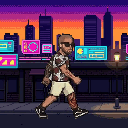

<p align="center">
  
</p>

<h1 align="center">aula-f75-pixel-fighter</h1>

<p align="center">
  Transforme uma foto sua num lutador de pixel art 8-bit<br>
  e coloque ele na tela do teclado <b>AULA F75 Max</b>.
</p>

<p align="center">
  <a href="README.md">English</a> ·
  <a href="#começando">Começando</a> ·
  <a href="#o-que-deu-trabalho-descobrir">O que deu trabalho descobrir</a>
</p>

---

Você manda uma foto pra um modelo de imagem e pede um spritesheet 4×4. Dois
scripts Python fazem o resto: cortam a grade, tiram o fundo, alinham os frames,
rolam um cenário atrás do personagem e escrevem um GIF que o teclado aceita.

O GIF aí em cima é o resultado final — 128 frames, 12 segundos, loop sem emenda.

## Começando

```bash
pip3 install pillow numpy
git clone https://github.com/sergiotravassos/aula-f75-pixel-fighter.git
cd aula-f75-pixel-fighter
python3 scene.py --out scene.gif --size 128x128 --fps 25 --bg-image street.png
```

Isso regenera o GIF a partir do `poses.png`. Pra fazer o seu próprio personagem,
troque as poses pelas suas — [o guia](GUIDE.md) explica desde a foto.

## O que tem aqui

| | |
|---|---|
| `scene.py` | Monta a cena completa: entra andando, luta, fecha o loop |
| `sheet2gif.py` | Transforma qualquer spritesheet num loop. Também faz figurinhas de WhatsApp |
| `poses.png` | As 40 poses que a cena usa, numa grade 8×5 |
| `street.png` | O cenário. Repete na horizontal sem emenda, pra poder rolar sempre |
| `scene.gif` | O resultado |
| [`GUIDE.md`](GUIDE.md) | O processo inteiro, da foto até o teclado (em inglês) |
| `tests/` | Dois GIFs que medem os limites reais do seu teclado |

## O que deu trabalho descobrir

É aqui que está o valor de verdade. Cada um custou uma tentativa perdida ou uma
tarde inteira.

**Não peça pro modelo contrariar a foto.** Foram seis gerações exigindo "só um
braço tatuado" enquanto a foto de referência mostrava claramente os dois. O
modelo colocava num braço, depois nos dois, depois em nenhum. Bastou mudar a
especificação pra bater com a realidade e acertou de primeira.

**Quando a animação sai errada, meça antes de gerar de novo.** Um ciclo de
caminhada que parecia flutuar tinha os dois pés nas mesmas duas posições x em
todas as 8 poses — as pernas dobravam mas nunca davam um passo. Devolver esses
números pro modelo produziu uma passada de verdade na tentativa seguinte, depois
de três rodadas descrevendo o problema com palavras não terem resolvido.

**Quando nenhuma geração está certa, monte a partir de todas.** A caminhada
precisava de poses de passagem reais e de uma tatuagem correta, e nenhuma folha
tinha as duas coisas. A medição mostrou que as quatro desenhavam o personagem na
mesma escala, então dava pra juntar as poses e ordenar pelo que o ciclo precisa.
Pare de pedir a folha perfeita; peça material suficiente.

**Meça a coisa certa.** Ordenar a caminhada pela distância entre os pés escondia
a estrutura — duas poses podem ter a mesma abertura e estar em pontos opostos do
ciclo. Medindo cada pé em relação ao quadril, as poses aprovadas se separaram em
três grupos limpos e o ciclo se montou sozinho.

**A escala tem que ser inteira.** Recortar na caixa do personagem dá 260×266, e
escalar isso pra 512 dá 1,925×. Com nearest-neighbour alguns pixels da origem
ficam com 2 px de largura e outros com 1, e o sprite parece mal desenhado.

**A paleta é repartida por área, não por importância.** Um cenário grande e chapado
fica com quase todas as vagas, e o personagem sobra com 7 cores e cara de lavado.
O `sheet2gif.py` pondera cada cor pela raiz quadrada da frequência: 31 cores
viraram 144 e o céu não perdeu nada.

**Cenário estático deixa o GIF quatro vezes menor.** Só 18,6% dos pixels mudam
entre frames, então `disposal=1` faz o GIF guardar só o retângulo alterado. Não
dá pra usar com transparência, onde cada frame precisa limpar o anterior ou o
personagem deixa rastro.

**Dê mais tempo ao impacto do que à preparação.** Um golpe em que todo frame dura
o mesmo vira borrão. Sai rápido, segura no impacto, volta rápido.

**O painel aguenta em rajada, não em regime.** Este só aparece no aparelho. Um
frame 128×128 em RGB565 tem 32 KB, então 25 fps significa empurrar 800 KB/s pra
tela sem pausa. O teclado dá conta disso em rajadas curtas, mas não por segundos
seguidos: uma cena com 72 frames consecutivos de 40 ms rodava bem nos primeiros
dois segundos, depois começava a pular frames e a saltar pra frente, a cada
loop, sempre no mesmo ponto. O mesmo arquivo roda perfeito no computador, que
decodifica em memória e nunca encosta nesse gargalo.

O aparelho passa num teste de taxa de quadros de um segundo por seção a 100 fps
e aceita os 255 frames completos, e nenhum dos dois fatos prevê isso. O que
importa é por quanto tempo você segura o ritmo mais rápido. Manter as sequências
de delay mínimo abaixo de meio segundo resolveu aqui — a maior nesta cena tem 5
frames, 0,2 s.

**Peça um cenário que repita.** Arte que não repete precisa ser espelhada pra
rolar sem emenda, e uma cópia espelhada se lê como espelho.

## Especificações do F75 Max

Lidas do código do driver, não chutadas:

| | |
|---|---|
| Tela | **128 × 128**, RGB565 |
| Máximo de frames | 255 |
| Passo do delay | 2 ms (`delay = round(segundos × 500)`) |
| Conexão | **USB-C com fio** — não passa por 2.4G nem Bluetooth |
| VID / PID | `0x0C45` / `0x800A` |

O GIF guarda o delay em centésimos de segundo, então só dá pra chegar em
múltiplos de 10 ms: 100, 50, 33, 25, 20 fps — nunca 60. E o GIF é o único formato
que carrega tempo: o driver lê o delay só do dicionário GIF, então um WebP
animado tocaria a 10 fps fixos.

O `tests/` mede o que o seu aparelho aceita. No que foi usado aqui: os 255 frames
completos, e 100 fps mantidos por um segundo de cada vez. Leia esse segundo
número com a ressalva acima — um ritmo que o painel aguenta por um segundo não é
um ritmo que ele aguenta por três.

## Driver no macOS

O driver oficial da AULA é só pra Windows. No Mac use o
[VitalyArt/Aula-F75-Max-Driver](https://github.com/VitalyArt/Aula-F75-Max-Driver).

A versão v1.3.0 quebra ao abrir: falta o bundle de recursos do SwiftPM dentro do
`.app`, e o `Bundle.module` chama `fatalError` na primeira string traduzida.
Correção enviada em
[#9](https://github.com/VitalyArt/Aula-F75-Max-Driver/issues/9) ·
[#10](https://github.com/VitalyArt/Aula-F75-Max-Driver/pull/10).
O [GUIDE.md](GUIDE.md) explica como compilar já corrigido enquanto isso.

## Créditos

O ponto de partida foi
[um post do @victorpfreitas](https://x.com/victorpfreitas/status/2097509107007721692):
manda umas fotos pro modelo, pede um spritesheet 4×4 em 8-bit, faz um GIF. Este
repositório é o resto do caminho.

## Licença

MIT.
